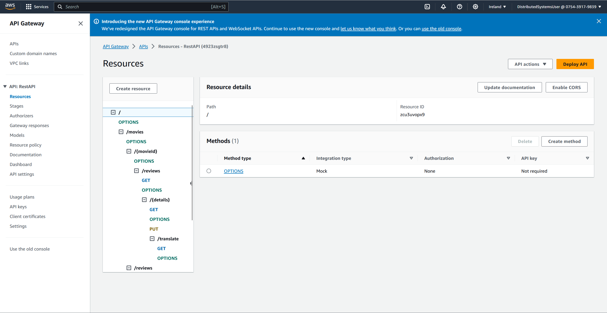
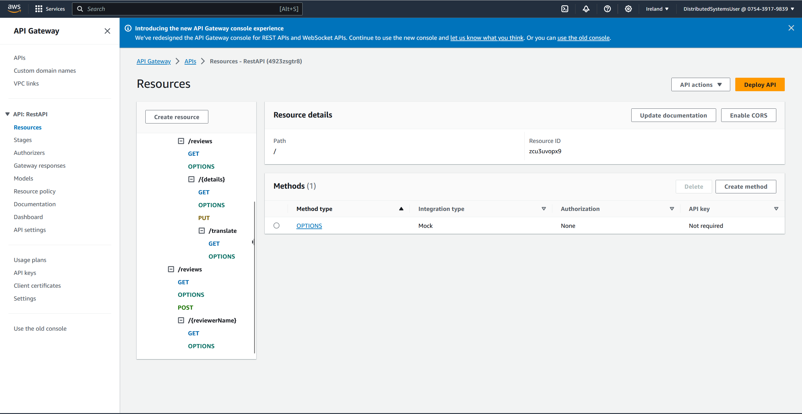
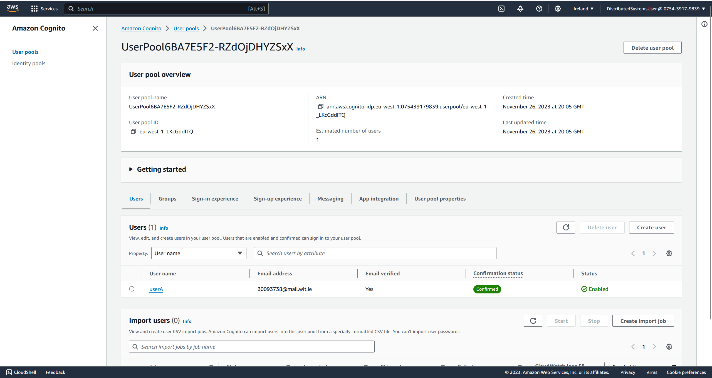

## ServerlessREST Assignment - Distributed Systems.

__Name:__ Jack Donohoe

This repository contains the implementation of a serverless REST API for the AWS platform. A CDK stack creates the infrastructure. The domain context of the API is movie reviews.

## Useful commands

* `npm run build`   compile typescript to js
* `npm run watch`   watch for changes and compile
* `npm run test`    perform the jest unit tests
* `cdk deploy`      deploy this stack to your default AWS account/region
* `cdk diff`        compare deployed stack with current state
* `cdk synth`       emits the synthesized CloudFormation template

### API endpoints.

+ __POST /movies/reviews__ - add a movie review.
+ __GET /movies/reviews__ - Get all movie reviews.
+ __GET /movies/reviews/{reviewerName}__ - Get the reviews written by the named reviewer.
+ __GET /movies/{movieId}/reviews__ - Get all the reviews for a movie with the specified id.
+ __GET /movies/{movieId}/reviews?minRating=n__ - Get all the reviews for the movie with the specified ID with a rating greater than the minRating.
+ __PUT /movies/{movieId}/reviews/{reviewerName}__ - Updates the movie with the specified movie ID and written by the named reviewer.
+ __GET /movies/{movieId}/reviews/{reviewerName}__ - Get the review for the movie with the specified movie ID and written by the named reviewer (takes the same input as year endpoint).
+ __GET /movies/{movie}/reviews/{year}__ - Get the review for the movie with the specified movie ID and written in the specified year (takes the same input as reviewer name endpoint).
+ __GET /movies/{movieId}/reviews/{reviewerName}/translation?language=code__ - Get the review for the movie with the specified movie ID and written by the named reviewer with translated content.

### Auth API endpoints.

+ __POST /auth/signup__ - Sign up a new user.
+ __POST /auth/confirm-signup__ - Confirm a new user.
+ __POST /auth/signin__ - Sign in a user.
+ __GET /auth/signout__ - Sign out a user.

### Authentication..

